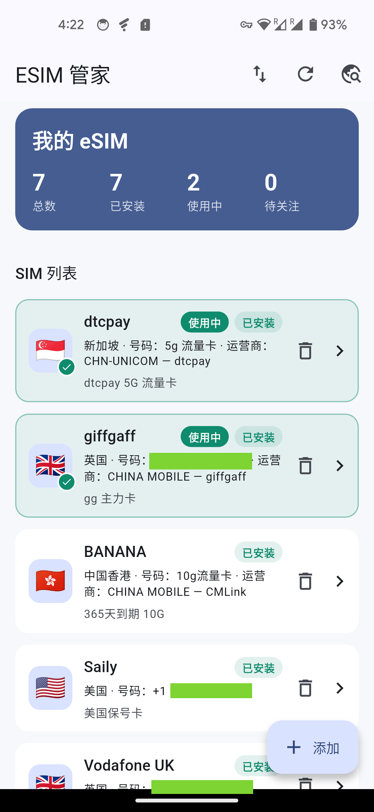
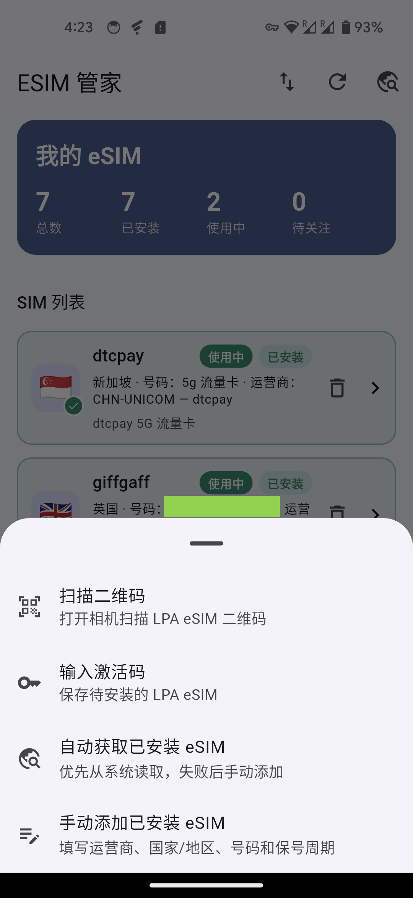
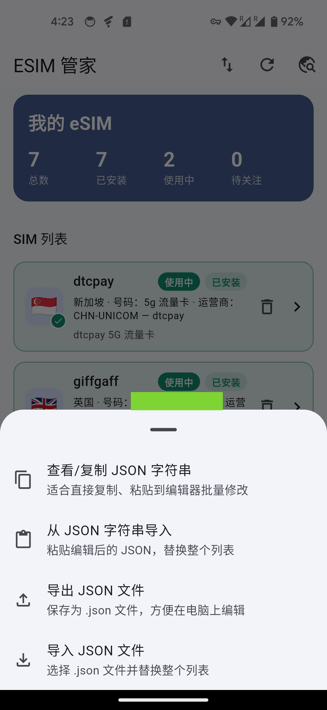
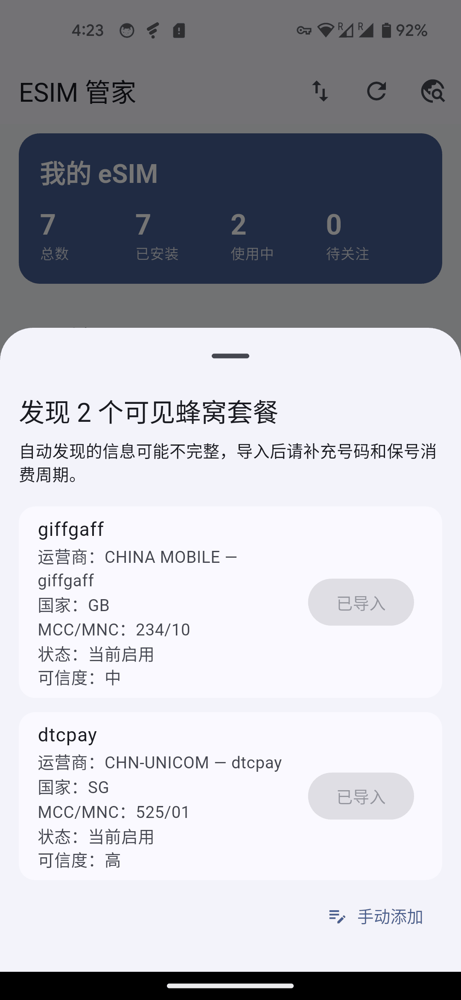

# ESIM 管家

ESIM 管家是一个用于管理 SIM / eSIM 信息的 Flutter 应用，重点解决旅行卡、流量卡、保号卡和待安装 eSIM 的记录、提醒、备份与二维码保存问题。

## 主要功能

- 管理已安装 SIM / eSIM：名称、运营商、国家/地区、手机号、ICCID、状态、备注。
- 自动发现系统可见的蜂窝套餐，并标记当前正在使用的 SIM。
- 扫描或手动保存 LPA eSIM 激活码，并可在详情页重新展示为二维码。
- 设置保号消费提醒，适合需要定期充值、发短信或消费保号的卡。
- JSON 整表导入 / 导出，方便备份、迁移和批量编辑。
- 敏感字段本地安全存储：手机号、ICCID、激活码、Matching ID 不直接写入普通偏好存储。

## 界面预览

| 首页列表 | 添加入口 |
| --- | --- |
|  |  |

| 导入 / 导出 | 自动发现 |
| --- | --- |
|  |  |

## 使用说明

### 添加 SIM / eSIM

首页点击右下角「添加」，可选择：

- 「扫描二维码」：扫描运营商提供的 LPA eSIM 二维码，保存为待安装 eSIM。
- 「输入激活码」：手动粘贴 `LPA:...` 激活码。
- 「自动获取已安装 eSIM」：读取系统可见的蜂窝套餐并导入。
- 「手动添加已安装 eSIM」：自行填写名称、运营商、国家/地区和号码。

名称是应用内识别 SIM 的唯一标识。手动添加或编辑时，如果名称已存在，应用会提示并阻止保存。

### 自动发现与刷新

首页右上角有两个相关按钮：

- 「刷新当前使用状态」：启动系统发现流程，按名称匹配已有 SIM，并更新“使用中”标识。
- 「自动获取已安装 eSIM」：显示系统发现列表，可手动导入未导入的 SIM。

发现列表中，如果某个系统套餐名称已存在，会显示「已导入」，不会再提供导入按钮。

如果系统发现的新卡名称和已有名称冲突，刷新流程会给新卡临时追加序号，例如 `旅行卡 2`，并提示你修改名称。

### 名称同步注意事项

应用按「名称」识别系统发现的 SIM。修改应用内 SIM 名称后，请同步修改手机系统设置里的 SIM 卡名称。

如果应用内名称和系统 SIM 名称不一致，后续刷新或自动发现时，系统返回的名称可能会被当成另一张卡，从而出现重复记录。

### 当前使用标识

列表中正在使用的 SIM 会排在最前面，并显示明显的「使用中」标识。应用启动后也会尝试自动刷新一次系统状态。

### 国家/地区

国家/地区通过列表选择，内置常见国家和地区，并在列表中展示国家信息。列表项左侧会显示国旗图标，便于快速识别。

### 保号提醒

进入 SIM 详情页后，可以开启「保号消费提醒」：

1. 打开「开启保号消费提醒」。
2. 选择最近一次消费、充值或短信日期。
3. 设置提醒周期（月），例如 6。

应用会计算下一次保号日期，并在临近时通过本地通知提醒。未开启保号提醒时，日期和周期不会显示。

### eSIM 激活码与二维码

通过二维码扫描或激活码输入保存的待安装 eSIM，会在详情页保留原始 LPA 字符串。

详情页默认隐藏激活码，避免截图或旁人看到。点击「显示激活码」后，可以查看文本并展示二维码，用于重新安装或迁移时扫描。

### 备注

备注默认为空，由用户自行填写。列表中会在卡片底部展示备注；如果备注过长，会自动截断为一行。

## 数据与隐私

- 数据保存在本机。
- 普通列表信息使用 `shared_preferences` 保存。
- 敏感字段使用 `flutter_secure_storage` 保存，包括手机号、ICCID、原始激活码和 Matching ID。
- 删除应用内记录不会删除系统中已安装的 SIM / eSIM。
- 扫描二维码只会把结果保存在本机，不会上传。

## 权限说明

### Android

应用会使用以下权限：

- 相机权限：扫描 eSIM 二维码。
- 电话状态 / 电话号码权限：读取系统可见的 SIM / eSIM 信息、当前启用状态，并尽最大努力读取号码。
- 通知权限：发送保号提醒。
- 开机完成权限：用于恢复本地提醒调度。

Android 是否能读取到号码取决于系统、运营商和 eSIM 配置。即使授权成功，号码也可能为空。此时请手动填写号码。

### iOS

iOS 对普通 App 开放的蜂窝信息非常有限，通常无法读取手机号、ICCID，也不能完整列出所有已停用 eSIM。iOS 端自动发现只能作为辅助，重要信息建议手动补充。

## 导入 / 导出

首页右上角「导入导出」支持：

- 查看 / 复制 JSON 字符串。
- 从 JSON 字符串导入。
- 导出 JSON 文件。
- 导入 JSON 文件。

导入会替换当前整个列表。导入时如果出现重复名称，应用会自动追加序号，保证列表内名称唯一。

导出的 JSON 顶层格式：

```json
{
  "schema": "esim_tool_profiles_v1",
  "exportedAt": "2026-06-23T00:00:00.000Z",
  "profiles": []
}
```

也支持直接导入 `profiles` 数组。

## 已知限制

- 系统自动发现并不等于完整读取所有 eSIM。不同手机、系统版本、运营商返回的信息差异很大。
- 手机号经常读取不到，尤其是纯流量卡、旅行 eSIM 或运营商未写入号码的卡。
- ICCID 也可能被系统权限限制，无法读取。
- 应用使用名称作为最终匹配依据，因此请保持应用内名称和系统 SIM 名称一致。
- eSIM 激活码属于敏感信息，请避免截图或分享给他人。

## 本地开发与验证

```bash
flutter pub get
flutter analyze
flutter test
flutter build apk --debug
```

Debug APK 输出位置：

```text
build/app/outputs/flutter-apk/app-debug.apk
```

Release APK：

```bash
flutter build apk --release
```

Release APK 输出位置：

```text
build/app/outputs/flutter-apk/app-release.apk
```

当前 release 构建使用 Android debug signing config，适合个人测试和临时安装，不适合作为正式上架签名包。

## 生成应用图标

应用图标由脚本生成：

```bash
mkdir -p .build/clang-module-cache
CLANG_MODULE_CACHE_PATH="$PWD/.build/clang-module-cache" \
  swift scripts/generate_app_icons.swift
rm -rf .build
```

脚本会生成 Android、iOS、macOS 和 Web 所需的图标尺寸。

## 发布 APK 到 GitHub Release

仓库已配置 GitHub Actions：

- 推送 `v*` tag 时自动构建 APK 并上传到对应 Release。
- 也可以在 GitHub Actions 页面手动运行 `Build Android APK Release`，可选填写 release tag。

本地可以用脚本构建并上传：

```bash
scripts/build_release.sh
# 或指定 tag
scripts/build_release.sh v1.0.0-20260623
```

Release 下载地址：

```text
https://github.com/lkiarest/esim_tools/releases
```

## iOS 上架准备

iOS App Store 上架准备文档已整理在：

- `docs/ios-app-store-release-checklist.md`
- `docs/ios-app-store-connect-template.md`
- `docs/privacy-policy.md`

本地构建 `ipa` 可使用：

```bash
scripts/build_ios_release.sh
```
